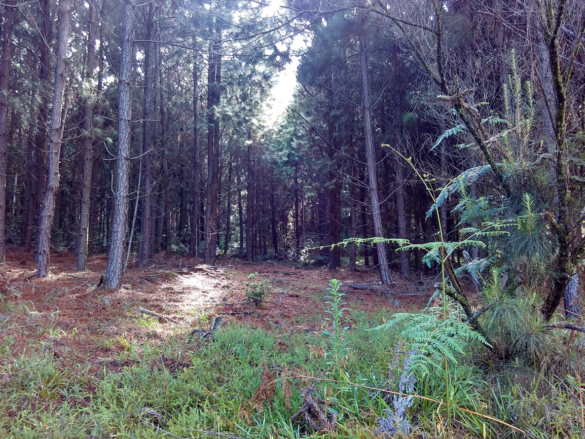
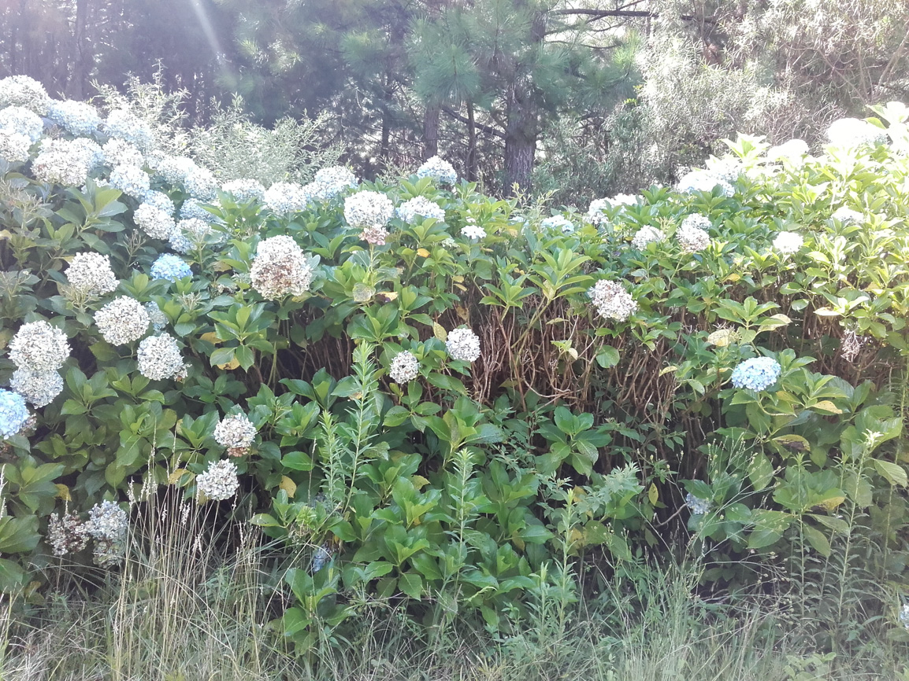
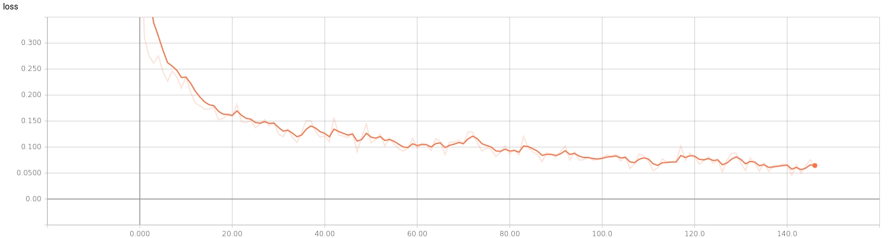
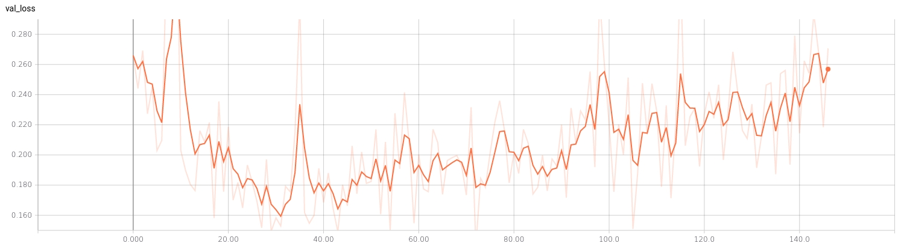

# kaggle-invasive-species
## Kaggle's competition: Invasive Species Monitoring
Identification of images of invasive hydrangea

## Non-invasive Example

## Invasive Example

<h1>Training Loss</h1>

<h1>Validation Loss</h1>

<h1>Kaggle Score</h1>

